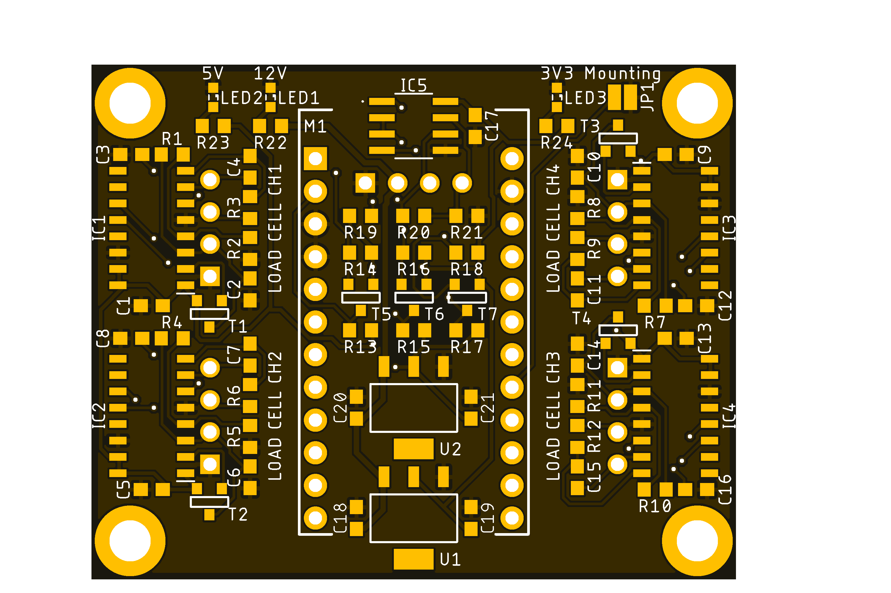

<html lang="en">
  <head>
    <meta charset="uft-8">
    <meta name="author" content="Masato Kubotera">
  </head>
  <body>
    <h1>FootForceSensor Ver. 1.0</h1>
    <h2>About FootForceSensor</h2>
    

      FootForceSensor is a sensor that measures the pressure applied to the sole of a biped robot's foot by attaching strain gauges (load cells) to four locations on each foot. 
      It is under development to detect the position of the robot's center of gravity and to improve gait control.
      <h3>About Ver. 1.0</h3>
      The values of the four strain gages can be read by the Pro Micro (usable as an Aruduino Leonardo) and transferred to the computer board via a USB interface or a 3.3V system RS-485 interface to which Kondo's B3M servo motors can be connected. 
      Power can be supplied from the same connector as one communication, from USB bus power in the case of USB interface communication, or from Kondo's B3M servo motor connector in the case of RS-485 interface communication. 
      To allow left and right legs to use the same firmware, a shortland is grounded on the board to identify left and right.
      <table>
        <tr>
          <td>
            <a href="image/brd_top.png">
              

                
              

            </a>
          </td>
          <td>
            

              under construction 
              
            

          </td>
        </tr>
        <tr>
          <td>
            

              PCB preview image
            

          </td>
          <td>
            

              After component mounting
            

          </td>    
        </tr>
      </table>
    

    <h2>Repository Contents</h2>
    

    <dl>
      <dt>\image</dt>
      <dd>PCB preview images and capture of design screen</dd>
      <dt>\libraries</dt>
      <dd>Libraries used in Autodesk Eagle design</dd>
      <dt>Schematic.pdf</dt>
      <dd>Circuit diagram of this product</dd>
      <dt>BOM.txt</dt>
      <dd>Parts lists output from design data</dd>
      <dt>.brd</dt>
      <dd>Board wiring design file by Autodesk Eagle</dd>
      <dt>.sch</dt>
      <dd>Schematic design file by Autodesk Eagle</dd>
      <dt>Gerber_data.zip</dt>
      <dd>Zip folder of Gerber format files for PCB manufacturing requests.</dd>
      <dt>LICENSE</dt>
      <dd>This is a license to use this product. Please confirm before use.</dd>
      <dt>.gitignore</dt>
      <dd>File to exclude cache files from management.</dd>
    </dl>
    

    <h2>Documentation</h2>
      

        <h3>BOM</h3>
          <table>
            <thead>
              <tr>
                <th> Eagle Design Parts # </th>
                <th> Q'ty </th>
                <th> Mfr. Product # </th>
                <th> Supplier </th>
                <th> Description </th>
              </tr>
            </thead>
            <tbody>
              <tr>
                <td> C1, C2, C3, C5, C6, C8, C9, C10, C12, C13, C14, C16 </td>
                <td> 12 </td>
                <td> GRM188R71E105KA12 </td>
                <td> <a href="https://akizukidenshi.com/catalog/g/gP-14526/">Akizuki</a> </td>
                <td> Multilayer Ceramic Capacitors SMD/SMT 1uF 25V 10% 0603 </td>
              </tr>
              <tr>
                <td> C18, C19, C20, C21 </td>
                <td> 4 </td>
                <td> GRM188R6YA106MA73 </td>
                <td> <a href="https://akizukidenshi.com/catalog/g/gP-13161/">Akizuki</a> </td>
                <td> Multilayer Ceramic Capacitors SMD/SMT 10uF 35V 20% 0603 </td>
              </tr>
              <tr>
                <td> C4, C7, C11, C15, C17 </td>
                <td> 5 </td>
                <td> GCM188L81H104K57 </td>
                <td> <a href="https://akizukidenshi.com/catalog/g/gP-16143/">Akizuki</a> </td>
                <td> Multilayer Ceramic Capacitors SMD/SMT 0.1uF 50V 10% 0603 </td>
              </tr>
              <tr>
                <td> CH1, CH2, CH3, CH4, CH5 </td>
                <td> 5 </td>
                <td> S4B-XH-A(LF)(SN) </td>
                <td> <a href="https://akizukidenshi.com/catalog/g/gC-12842/">Akizuki</a> </td>
                <td> Connector Header Through Hole, Right Angle 4 position 2.5mm </td>
              </tr>
              <tr>
                <td> IC1, IC2, IC3, IC4 </td>
                <td> 4 </td>
                <td> HX711 </td>
                <td> <a href="https://akizukidenshi.com/catalog/g/gI-12473/">Akizuki</a> </td>
                <td> 24-Bit Analog-to-Digital Converter (ADC) for Weigh Scales </td>
              </tr>
              <tr>
                <td> IC5 </td>
                <td> 1 </td>
                <td> ADM3078E </td>
                <td> <a href="https://www.mouser.jp/ProductDetail/584-ADM3078EARZ">Mouser</a> </td>
                <td> RS-485/RS-422 Transceiver (Half Duplex, 16 Mbps, DE/RE) </td>
              </tr>
              <tr>
                <td> LED1, LED2, LED3 </td>
                <td> 3 </td>
                <td> 150060VS86000 </td>
                <td> <a href="https://www.mouser.jp/ProductDetail/710-150060VS86000">Mouser</a> </td>
                <td> Standard LEDs - SMD Green 2V 20mA 573nm 0603 </td>
              </tr>
              <tr>
                <td> M1 </td>
                <td> 1 </td>
                <td> DEV-12640 </td>
                <td> <a href="https://www.mouser.jp/ProductDetail/474-DEV-12640">Mouser</a> </td>
                <td> Development Boards & Kits - AVR Pro Micro - 5V/16MHz </td>
              </tr>
              <tr>
                <td> M1 </td>
                <td> 1 </td>
                <td> 6604S-40 </td>
                <td> <a href="https://akizukidenshi.com/catalog/g/gP-01591/">Akizuki</a> </td>
                <td> 2.54mm Pin Socket Strip, Single Row </td>
              </tr>
              <tr>
                <td> M1 </td>
                <td> 1 </td>
                <td> PHA-1x40SG </td>
                <td> <a href="https://akizukidenshi.com/catalog/g/gC-06631/">Akizuki</a> </td>
                <td> 2.54mm Pin Header Strip, Straight, Single Row </td>
              </tr>
              <tr>
                <td> R1, R4, R7, R10 </td>
                <td> 4 </td>
                <td> RC0603FR-1320KL </td>
                <td> <a href="https://www.mouser.jp/ProductDetail/603-RC0603FR-1320KL">Mouser</a> </td>
                <td> Thick Film Resistors - SMD 20 kOhms 100-200mW 1% 0603 </td>
              </tr>
              <tr>
                <td> R13, R14, R15, R16, R17, R18 </td>
                <td> 6 </td>
                <td> RC0603FR-1010KL </td>
                <td> <a href="https://www.mouser.jp/ProductDetail/603-RC0603FR-1010KL">Mouser</a> </td>
                <td> Thick Film Resistors - SMD 10 kOhms 100-200mW 1% 0603 </td>
              </tr>
              <tr>
                <td> R19, R21 </td>
                <td> 2 </td>
                <td> RC0603FR-10680RL </td>
                <td> <a href="https://www.mouser.jp/ProductDetail/603-RC0603FR-10680RL">Mouser</a> </td>
                <td> Thick Film Resistors - SMD 680 Ohms 100-200mW 1% 0603 </td>
              </tr>
              <tr>
                <td> R2, R5, R8, R11 </td>
                <td> 4 </td>
                <td> RC0603FR-138K2L </td>
                <td> <a href="https://www.mouser.jp/ProductDetail/603-RC0603FR-138K2L">Mouser</a> </td>
                <td> Thick Film Resistors - SMD 8.2 kOhms 100-200mW 1% 0603 </td>
              </tr>
              <tr>
                <td> R20 </td>
                <td> 1 </td>
                <td> RC0603FR-10120RL </td>
                <td> <a href="https://www.mouser.jp/ProductDetail/603-RC0603FR-10120RL">Mouser</a> </td>
                <td> Thick Film Resistors - SMD 120 Ohms 100-200mW 1% 0603 </td>
              </tr>
              <tr>
                <td> R3, R6, R9, R12, R22, R23, R24 </td>
                <td> 7 </td>
                <td> RC0603FR-101KL </td>
                <td> <a href="https://www.mouser.jp/ProductDetail/603-RC0603FR-101KL">Mouser</a> </td>
                <td> Thick Film Resistors - SMD 1 kOhms 100-200mW 1% 0603 </td>
              </tr>
              <tr>
                <td> T1, T2, T3, T4 </td>
                <td> 4 </td>
                <td> MMBT3906 </td>
                <td> <a href="https://akizukidenshi.com/catalog/g/gI-05967/">Akizuki</a> </td>
                <td> Bipolar Transistors - BJT Bipolar Transistor, SOT-23, 40V, 200mA, PNP </td>
              </tr>
              <tr>
                <td> T5, T6, T7 </td>
                <td> 3 </td>
                <td> BSS138 </td>
                <td> <a href="https://akizukidenshi.com/catalog/g/gI-04232/">Akizuki</a> </td>
                <td> 50V N-Channel Enhancement Mode MOSFET - ESD Protected </td>
              </tr>
              <tr>
                <td> U1 </td>
                <td> 1 </td>
                <td> LM1117GS-3.3 </td>
                <td> <a href="https://akizukidenshi.com/catalog/g/gI-16989/">Akizuki</a> </td>
                <td> LDO Voltage Regulator 3.3V 1A </td>
              </tr>
              <tr>
                <td> U2 </td>
                <td> 1 </td>
                <td> LD1117S50 </td>
                <td> <a href="https://akizukidenshi.com/catalog/g/gI-15255/">Akizuki</a> </td>
                <td> LDO Voltage Regulator 5.0V 0.8A </td>
              </tr>
            </tbody>
          </table>          
        <h3>PCB Fabrication</h3>
          PCB(Printed Circuit Board) manufacturing was outsourced to <a href="https://www.elecrow.com/pcb-manufacturing.html">Elecrow</a>. 
          The custom specifications are as follows.
          <ul>
            <li>Layer : 2 layers</li>
            <li>Dimensions : 50 x 40</li>
            <li>Different PCB Design : 1eg</li>
            <li>PCB Thickness : 1.6</li>
            <li>PCB Color : Black</li>
            <li>Surface Finish : HASL</li>
            <li>Castellated Hole : No</li>
            <li>Copper Weight : 1oz</li>
            <li>PCB Stencil : Stencil 10cm X 10cm no frame[Top]</li>
          </ul>
          The data used to order fabrication are as follows.
          <ul>
            <li>Eagle design rule : <a href="https://www.elecrow.com/download/Elecrow_PCB_eagle_rule.zip">Elecrow Eagle Design Rule</a></li>
            <li>Eagle CAM file : <a href="https://www.elecrow.com/download/Elecrow_Gerber_Generater_DrillAlign.zip">Elecrow CAM file</a></li>
            <li>Gerber format data : <a href="/Gerber_data.zip">Gerber_data.zip</a></li>
          </ul>
      

    <h2>Contact</h2>
    

    If you have any questions, please contact MasatoKubotera, the product's designer, by E-mail. 
    E-mail : <a href="mailto:masatokubotera06@yahoo.co.jp">masatokubotera06@yahoo.co.jp</a>
    

    <h2>License Information</h2>
    

      This product is open source. 
      Please review the <a href="/LICENSE">LICENSE file</a> for license information. 
       
      <strong>FootForceSensor Ver. 1.0</strong> by Masato Kubotera is licensed under a <a href="http://creativecommons.org/licenses/by-nc-sa/4.0/">Creative Commons Attribution-NonCommercial-ShareAlike 4.0 International License</a>.
    
    
  </body>
</html>
